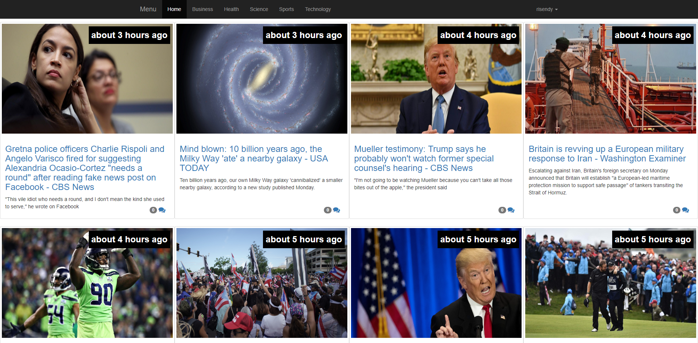

## Table of contents
* [General info](#general-info)
* [Technologies](#technologies)
* [Features](#features)
* [Screenshots](#screenshots)

## General info
Laravel news feed portal using newsapi.org
	
## Technologies
Project is created with:
* Laravel 5.4
* Guzzlehttp/guzzle 6.3
* JQuery Timeago library 1.6.1

## Features
* Displaying recent news headlines
* Displaying news in categories: Business, Health, Science, Sports, Technology
* Comes with the command enabling to fetch headlines from newsApi.org and save them to database. Can be easily set up with cron to always have the most recent news without any work.
* Comes with the command to recycle old News

## Screenshots

